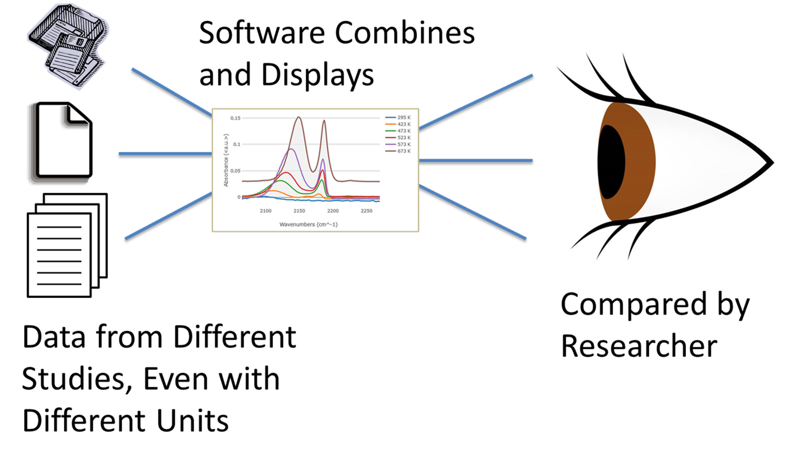

.. JSONGrapher documentation master file

Welcome to JSONGrapher’s Documentation
======================================

JSONGrapher is a Python library for visualizing and working with JSON data
through graph-based structures.  
This documentation provides tutorials, guides, and full API reference.

----

Installation
============

.. toctree::
   :maxdepth: 1
   :caption: Installation

   install

Tutorials
=========

.. toctree::
   :maxdepth: 2
   :caption: Tutorials

   tutorials/getting_started
   tutorials/examples

Topic Guides
============

.. toctree::
   :maxdepth: 2
   :caption: Topic Guides

   guides/usage
   guides/architecture
   guides/faq

Reference
=========

.. toctree::
   :maxdepth: 3
   :caption: Reference
   :glob:

   modules
   JSONGrapher/*

Troubleshooting
===============

.. toctree::
   :maxdepth: 1
   :caption: Troubleshooting

   troubleshooting/common_issues
   troubleshooting/debugging

Frequently Asked Questions
==========================

.. toctree::
   :maxdepth: 1
   :caption: FAQ

   faq
